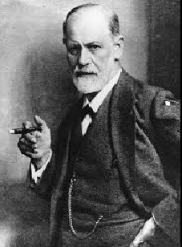
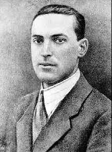

```{r setup, include=FALSE}
options(htmltools.dir.version = FALSE)
library(knitr)
knitr::opts_chunk$set(warning = FALSE, message = FALSE)
# options(knitr.table.format = "html")
library(tidyverse)
library(babynames)
library(fontawesome) # from github: https://github.com/rstudio/fontawesome
library(DiagrammeR)
```

layout: true
  
<div class="my-footer"><span>Psicologia 3º Semestre - UFMT  | Psicologia Social - Prof: Alessandro Vinicius de Paula  |  e-mail: kedmathayktps@gmail.com | link do slide online: https://bit.ly/31i4gjG </span></div>

<!-- this adds the link footer to all slides, depends on my-footer class in css-->

---
name: bookdown-title
background-image: url(img/raphael-lovaski-unsplash.jpg)
background-size: cover
class: inverse


<br>
<br>


# Maquiagem como

# instrumento terapêutico

# sob dois aspectos

<br>
<br>
<br>
<br>
<br>
<br>

.large[`r rmarkdown::metadata$author`]

<!-- this ends up being the title slide since seal = FALSE-->


---
exclude: true
name: lifecycle

individual files:

.Rmd to .md (via knitr)

.md to HTML (via pandoc)


HTML to lots of HTML --> BOOK (via bookdown)

---
background-image: url(img/fares-hamouche-unsplash.jpg)
background-size: cover
class: inverse

# AUTOIMAGEM


---
background-image: url(img/eye-for-ebony-unsplash.jpg)
background-size: cover
class: inverse


# AUTOESTIMA


---

### VISAGISMO E MAQUIAGEM 

<!-- Works with xaringan's default CSS -->

.pull-left[
```{r plot-label1, echo=FALSE, message=FALSE, warning=FALSE}
# para retirar notacoes cientifica
options(scipen = 999)


#install.packages(tidyverse)
library(tidyverse)

# criando a tabela com dados da figura 2
# em Brum, Maravieski, Bertim (2013)
Brum_Maravieski_Bertim_2013 <- tibble(
  adolescentes = c(
    "A", "B", "C", "D", "E", "F", "G"
  ),
  antes = c(
    16, 10, 13, 25, 26, 13, 15
  ),
  depois = c(
    20, 19, 22, 22, 26, 27, 23
  )
)


# criando uma variavel de variacao percentual
variacao_percentual <- Brum_Maravieski_Bertim_2013 %>%
  mutate(var_pct = ((depois/antes) - 1) # * 100
         ) %>%
  select(-depois, -antes)


# empilhando os dados para gerar o grafico de baras
Brum_Maravieski_Bertim_2013 <- Brum_Maravieski_Bertim_2013 %>%
  gather(avaliação, escores, antes,depois)


# REPRESENTACAO GRAFICA

# install.packages("viridis")
# library(viridis)
library(RColorBrewer)
# scale_fill_viridis_d works just the same as
# scale_colour_viridis_d but for fill colours
Brum_Maravieski_Bertim_2013 %>%
  ggplot( aes(x=adolescentes, y=escores, fill=avaliação)) +
  geom_bar(stat="identity", position=position_dodge()) +
  #scale_fill_viridis_d()
  #scale_fill_grey(start = 0.8, end = 0.2)
  geom_text(aes(label=escores), vjust=1.6, color="white",
            position = position_dodge(0.9), size=3.5)+
  scale_fill_brewer(palette="Paired")+
  labs(x='',y='',
       title='Escores de autoestima obtidos antes e depois das oficinas de visagismo \ne maquiagem em adolescentes institucionalizadas',
       caption='Fonte: Brum, Maravieski, Bertim (2013)') +
  theme_minimal()

```
]

.pull-right[
````{r plot-label2, echo=FALSE, message=FALSE, warning=FALSE}


# grafico variacao percentual
# scale_colour_viridis_d but for fill colours
attach(variacao_percentual)
variacao_percentual %>%
  ggplot( aes(x=adolescentes, y=var_pct)) +
  geom_bar(stat="identity", fill = ifelse(var_pct>0, "#1e569e", "gray"),
           colour = ifelse(var_pct>0, "#1e569e", "gray"),
           position=position_dodge()) +
  ylim(-0.30,1.50) +
  geom_text(
    aes(label= scales::percent(var_pct)), size=3,
    fontface='bold',
    position = position_dodge(width = 2),
    hjust=0.5, vjust=ifelse(var_pct>0,-0.7,1),
    shape=21, colour=ifelse(var_pct>0,"black", 'red'))+
  #scale_fill_viridis_d()
  #scale_fill_grey(start = 0.8, end = 0.2)
  scale_fill_brewer(palette="Paired")+
  labs(x='',y='',
       title='Variação entre as avaliações',
       caption='Fonte: Brum, Maravieski, Bertim (2013)') +
  scale_y_continuous(labels = scales::percent) +
  theme_minimal()


```
]

---
class: middle

.center[
<video width="320" height="568" controls>
  <source src="img/camuflagem.mp4" type="video/mp4">
</video>
]


---
background-image: url(img/pierrick-van-unsplash.jpg)
background-size: cover
class: inverse

# MAQUIAGEM ARTÍSTICA


---
background-image: url(img/arteterapia.jpg)
background-size: cover

---
class: middle


.pull-left[

## Catarse

```{r out.width="100%", echo=FALSE}

```
]

.pull-right[

## Autonomia do sujeito

```{r out.width="100%", echo=FALSE}

```
]


---
background-image: url(img/glowup.jpg)
background-size: cover


---

.pull-left[

```{r, out.width="100%", echo=FALSE}
knitr::include_graphics("https://media2.giphy.com/media/1iu8uG2cjYFZS6wTxv/giphy-downsized.gif")
```

]

.pull-right[

#### **Referências**:

- ANDRADE, Maria Antonia Alonso de; ALONSO, Maria Antonia. A identidade como
representação social. Revista Política &amp; Trabalho, João Pessoa, Universidade Federal da
Paraíba, n. 11, p. 63-73, 1995.

- BARROCO, Sonia Mari Shima; SUPERTI, Tatiane. Vigotski eo estudo da psicologia da arte:
contribuições para o desenvolvimento humano. Psicologia &amp; sociedade, v. 26, n. 1, p. 22-31,
2014.

- BRUM, Lucimar Filot da Silva; MARAVIESKI, Silvinha; BERTIM, Fernanda Raquel Silva.
INFLUÊNCIA DO VISAGISMO E DA MAQUIAGEM NA AUTOESTIMA DE
ADOLESCENTES INSTITUCIONALIZADAS. Revista Interdisciplinar de Estudos em
Saúde, v. 2, n. 2, p. 11-24, 2013.

- GOLDBERG, Luciane Germano; YUNES, Maria Angela Mattar; FREITAS, José Vicente de. O
desenho infantil na ótica da ecologia do desenvolvimento humano. Psicologia em estudo, v. 10,
n. 1, p. 97-106, 2005.

]

---

.pull-left[

```{r, out.width="100%", echo=FALSE}
knitr::include_graphics("https://media2.giphy.com/media/1iu8uG2cjYFZS6wTxv/giphy-downsized.gif")
```

]

.pull-right[

#### **Referências**:

- RECH, Gabriela et al. Camuflagem Cosmética: O Uso da Maquiagem para a Correção dos
Defeitos da Pele. UNIVALI, Florianópolis, Santa Catarina, 2010.

- REIS, Alice Casanova dos. Arteterapia: a arte como instrumento no trabalho do Psicólogo.
Psicologia: Ciência e Profissão, v. 34, n. 1, p. 142-157, 2014.

- SERRA, Adriano Supardo Vaz. O auto-conceito. Análise psicológica, v. 6, p. 101-110, 1988.

- SILVEIRA, Natália Maia Braz. Automaquiagem como exercício cênico. 2016.

- WACHELKE, João Fernando Rech; CAMARGO, Brigido Vizeu. Representações sociais,
representações individuais e comportamento. Interamerican Journal of Psychology, v. 41, n. 3,
p. 379-390, 2007.
]


---
class: middle  


.pull-left[

# Agradecimentos

```{r, out.width="100%", echo=FALSE}
knitr::include_graphics("https://media1.giphy.com/media/3oz8xIsloV7zOmt81G/giphy.gif")
```

]

.pull-right[

#### **Encontrem meu trabalho online**:

  - Repositório do GitHub desta apresentação:
    - [kedmathay/kedma_portifoliomakeup](https://github.com/kedmathay/kedma_portifoliomakeup)
    
  - Link do Slide Online:
    - [https://bit.ly/31i4gjG](https://bit.ly/31i4gjG)

]
